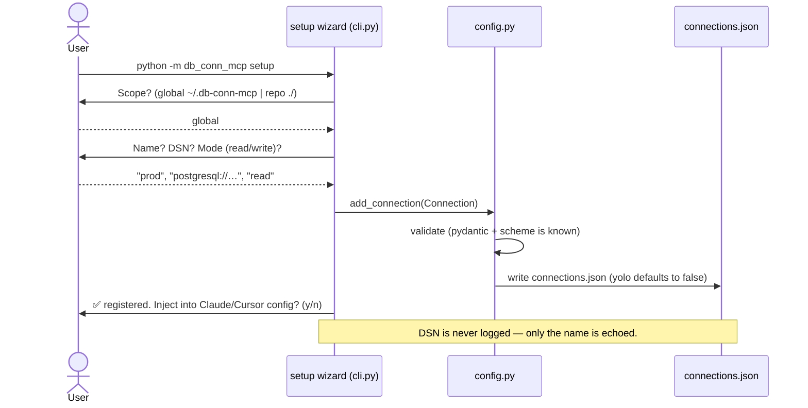
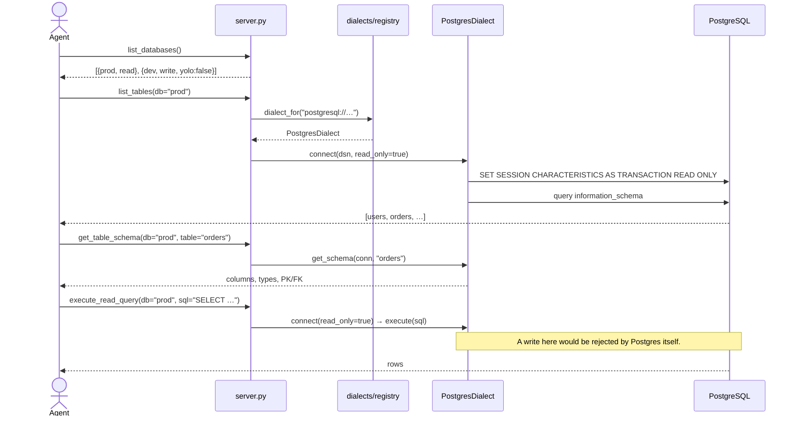
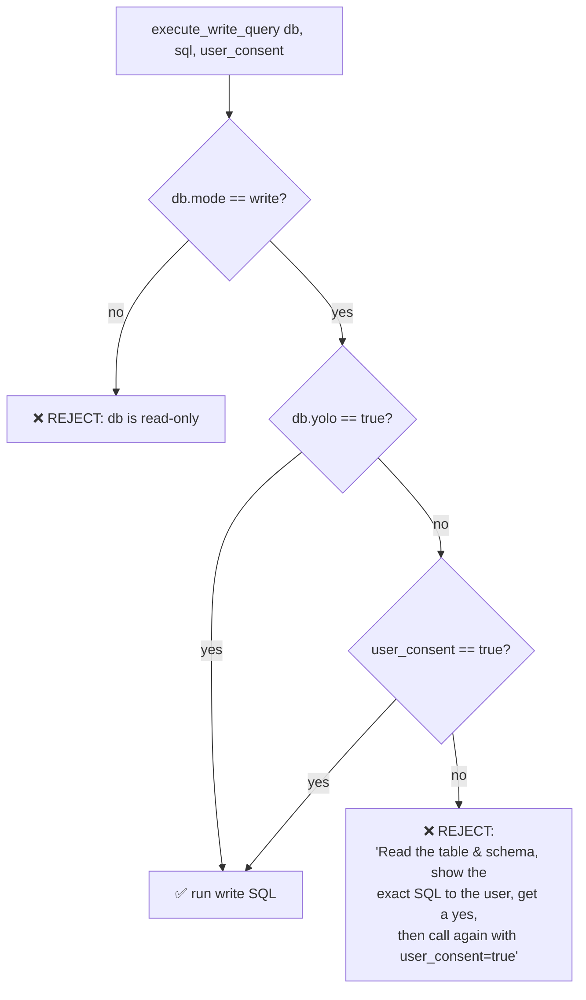
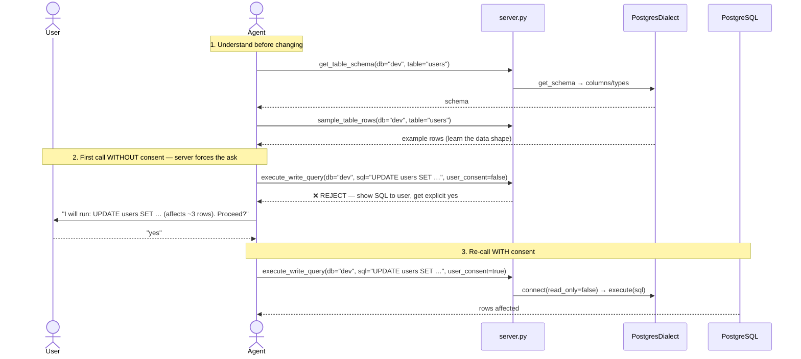
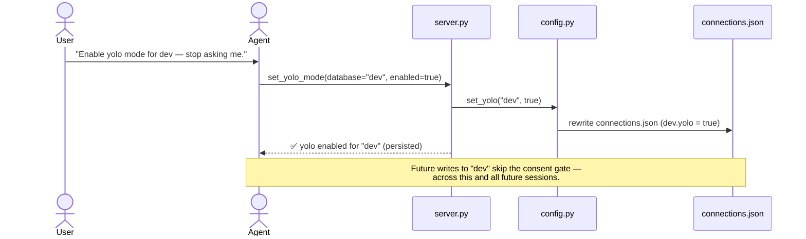
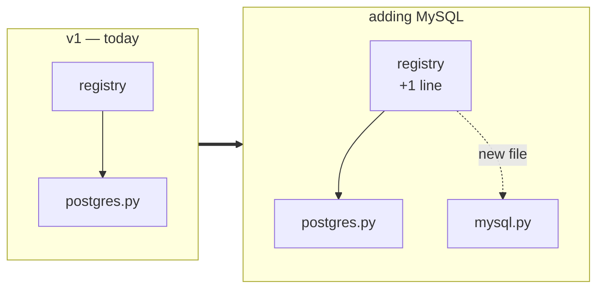

# Architecture: `db-conn-mcp`

This document shows how `db-conn-mcp` is structured and traces the **end-to-end flow**, from a user setting up a connection on the CLI, through an AI agent exploring and querying the database, to the write-safety gate that protects their data.

> **v1 scope:** PostgreSQL only. The code is built around a **dialect seam** so adding MySQL / SQLite later is a *one-file* job. See [Extensibility](#extensibility-adding-a-database).

---

## 1. Component Overview

```
                            ┌──────────────────────────────────────────┐
   ┌──────────────┐         │              db-conn-mcp                  │
   │  AI Agent    │  MCP    │  server.py  ── 12 tools + 2 prompts       │
   │ (Claude,     │◄───────►│      │                                   │
   │  Cursor, …)  │ stdio/  │      ├─► safety.py      ── write-gate     │
   └──────────────┘  http   │      │                                   │
                            │      ├─► diagnostics.py ── doctor /       │
   ┌──────────────┐         │      │     sanitized error → cause + fix  │
   │  Human user  │  CLI    │      ▼                                   │
   │ (terminal)   │────────►│  dialects/   ── Postgres SQL + RO guard  │
   └──────────────┘ setup   │   (registry) │        config.py ◄─ conns │
                            └──────┼───────────────────────│──────────┘
                                   ▼                        ▼
                            ┌─────────────┐         ┌────────────────┐
                            │ PostgreSQL  │         │connections.json│
                            └─────────────┘         └────────────────┘
```

### Module responsibilities (single-purpose layers)

| Module | Responsibility | Knows about Postgres? |
|---|---|---|
| `cli.py` | Parse args (`--config`, `--transport`); run server or a management subcommand (`setup`/`status`/`add`/`clients`/`remove`/`yolo`); detect & inject MCP clients | No |
| `config.py` | Resolve, load, validate, **and save** `connections.json` | No |
| `models.py` | Pydantic types: `Connection{name, dsn, mode, yolo}`, `Config` | No |
| `dialects/base.py` | The `Dialect` ABC — the extensibility contract | No |
| `dialects/postgres.py` | `asyncpg` impl + native read-only enforcement | **Yes (only here)** |
| `dialects/registry.py` | Map DSN scheme → `Dialect`; clear error on unknown scheme | No |
| `safety.py` | Pure write-gate decision (`mode` + `yolo` + `consent`) | No |
| `diagnostics.py` | Classify driver errors → **sanitized** cause + fix; the doctor | No |
| `handlers.py` | The 12 tool handlers as plain async methods (transport-free, unit-testable) | No |
| `server.py` | `FastMCP` app: registers the 12 tools + 2 prompts onto `handlers`, transport wiring | No |

The **dialect layer is the only place that knows a database is PostgreSQL.** Everything above it speaks the abstract `Dialect` contract.

---

## 2. The Tools an Agent Sees

| # | Tool | Kind | Safety |
|---|---|---|---|
| 1 | `list_databases` | Explore | safe — names + mode + yolo |
| 2 | `list_tables` | Explore | safe |
| 3 | `get_table_schema` | Explore | safe |
| 4 | `get_database_schema` | Explore | safe — whole-DB schema, deterministic; `format` json or self-contained SQL DDL |
| 5 | `dump_schema_faithful` | Export | safe (read-only) — faithful `pg_dump -s`; DSN never leaks; `pg_dump_not_found` if the binary is absent |
| 6 | `sample_table_rows` | Explore | safe (first N rows) |
| 7 | `find_columns` | Search | safe — fuzzy column-name search across tables |
| 8 | `search_value` | Search | safe (read-only) — fuzzy value search across tables; scoped/bounded |
| 9 | `execute_read_query` | Execute | runs inside a **read-only transaction** |
| 10 | `execute_write_query` | Execute | **gated** (mode → yolo → consent) |
| 11 | `set_yolo_mode` | Config | persists `yolo` flag for one named DB |
| 12 | `check_database` | Doctor | tests one DB (or all) → `OK` or sanitized cause + fix |

Plus **two MCP prompts** — `troubleshoot_connection` (a discoverable, full connection-gotchas checklist for when a DB won't connect, see [§7](#7-flow-e--self-diagnosing-connections-the-doctor)) and `faithful_schema_export` (how to choose the self-contained vs. `pg_dump` schema export, and how to offer installing `pg_dump`).

---

## 3. Flow A — Setup (human, on the CLI)

A human runs the wizard once to register a database. This is the *only* step that handles a raw DSN.



Resulting `connections.json`:
```json
{
  "connections": [
    { "name": "prod", "dsn": "postgresql://…", "mode": "read" },
    { "name": "dev",  "dsn": "postgresql://…", "mode": "write", "yolo": false }
  ]
}
```

**Config resolution order** (first match wins): `--config <path>` → `./connections.json` → `~/.db-conn-mcp/connections.json`.

---

## 4. Flow B — Agent explores, then runs a READ query

The everyday safe path. The agent discovers what exists, learns the schema, then queries.



Read-only is enforced **natively by the database** — even a `read`-mode connection physically cannot mutate data, regardless of what SQL is sent.

---

## 5. Flow C — Agent runs a WRITE query (the safety gate)

This is the heart of the safety model. The decision lives **in the server**, not in the agent's good intentions.



The intended agent choreography for a non-yolo write:



`mode` is the **hard boundary** (native, unbypassable). `yolo` and `user_consent` only relax the *prompt* on a DB that is *already* `write` — they can never make a `read` DB writable.

---

## 6. Flow D — Enabling YOLO mode (persisted)

When the user is tired of confirming every write on a trusted DB, they ask the agent to enable yolo. The server writes it back to disk so it survives restarts.



`set_yolo_mode("dev", false)` reverts it. YOLO is **per-database**: enabling it on `dev` never affects `prod`.

---

## 7. Flow E — Self-diagnosing connections (the doctor)

Connections are validated **lazily**: the server boots even if a database is down, and *any* tool that hits an unreachable DB gets a sanitized, actionable diagnostic instead of a raw stack trace. The agent (or user) can also probe proactively with `check_database`.

```mermaid
sequenceDiagram
    actor Agent
    participant Server as server.py
    participant Diag as diagnostics.py
    participant PG as PostgresDialect
    participant DB as PostgreSQL

    Agent->>Server: check_database(name="prod")
    Server->>PG: connect(dsn, read_only=true)
    PG->>DB: TCP connect / auth
    DB--xPG: error (refused / auth / no-db / SSL / timeout)
    PG-->>Server: raises driver exception
    Server->>Diag: explain(error)  ⟵ DSN/password NEVER passed in
    Diag-->>Server: {category, cause, fixes[]}
    Server-->>Agent: "❌ prod unreachable — AUTH FAILED.<br/>Likely: wrong user/password or role missing.<br/>Fix: verify credentials; confirm the role exists.<br/>(full checklist: prompt 'troubleshoot_connection')"
    Note over Agent: For the complete gotchas list:
    Agent->>Server: getPrompt("troubleshoot_connection")
    Server-->>Agent: full host/port/firewall/sslmode/<br/>container-localhost/db-name/pool checklist
```

**Error classification** (`diagnostics.py` maps driver exception → sanitized advice — credentials never appear in the output):

| Category | Triggered by (examples) | Sanitized cause + fix shown to agent |
|---|---|---|
| `AUTH_FAILED` | invalid password / role does not exist | "Wrong user/password, or the role doesn't exist. Verify credentials and that the role exists." |
| `HOST_UNREACHABLE` | connection refused / timeout | "DB not accepting connections. Is it running? Check host/port, firewall. In Docker, `localhost` ≠ the DB container." |
| `DB_NOT_FOUND` | database "x" does not exist | "Database name is wrong or not created yet. Check spelling/case; create it if needed." |
| `DNS_FAILURE` | could not translate host name | "Hostname can't be resolved — likely a typo in the host or a missing VPN/network." |
| `SSL_REQUIRED` | server requires SSL | "Server demands SSL. Add `?sslmode=require` (or appropriate mode) to the DSN." |
| `POOL_EXHAUSTED` | too many connections | "Connection limit hit. Close idle sessions or raise the server's `max_connections`." |
| `UNKNOWN` | anything unmatched | "Unrecognized connection error. See the `troubleshoot_connection` prompt for the full checklist." |

The **`troubleshoot_connection` MCP prompt** is the standalone, full gotchas checklist — discoverable by the agent at any time, not just on error. Targeted fixes appear inline per error; the prompt is the complete reference.

> **Security:** `diagnostics.explain()` receives only the *driver exception type/message-class* — never the `Connection` object or DSN — so no host, user, or password can leak into a tool response or log.

---

## 8. Extensibility — Adding a Database

Adding MySQL or SQLite later touches **exactly one new file** plus a one-line registration. Nothing above the dialect layer changes.



The contract a new dialect must satisfy:

```python
class Dialect(ABC):
    scheme: str                                       # e.g. "mysql"
    async def connect(self, dsn, *, read_only): ...   # native read-only enforcement lives here
    async def list_tables(self, conn): ...
    async def get_schema(self, conn, table): ...
    async def sample_rows(self, conn, table, n=10): ...
    async def execute(self, conn, sql): ...
```

| DB | Read-only mechanism (inside `connect`) | Introspection source |
|---|---|---|
| PostgreSQL (v1) | `SET SESSION CHARACTERISTICS AS TRANSACTION READ ONLY` | `information_schema` |
| MySQL (future) | `START TRANSACTION READ ONLY` | `information_schema` |
| SQLite (future) | open file with `?mode=ro` | `sqlite_master` / `PRAGMA` |

Because each dialect owns its own read-only enforcement and catalog queries, those per-database differences **never leak** into `safety.py` or `server.py`.

---

## 9. End-to-End at a Glance

```
Human ──setup──► connections.json ──read──► config.py
                                              │
AI Agent ──MCP (stdio/http)──► server.py ─────┼─► safety.py     (write gate)
                                  │            ├─► diagnostics.py (doctor, sanitized)
                                  ▼            ▼
                              dialects/registry ──► PostgresDialect ──► PostgreSQL
                                (scheme → impl)      (RO guard + SQL)
```

1. A human registers a DB once via the CLI wizard → `connections.json`.
2. An agent connects over MCP and **explores** (`list_*`, `get_table_schema`, `sample_table_rows`) — always read-only.
3. **Reads** run inside a native read-only transaction.
4. **Writes** pass through the server-side gate: `mode` (hard) → `yolo` (persisted trust) → `user_consent` (per-op ask).
5. `set_yolo_mode` lets a trusted DB skip the per-op ask, persisted to disk.
6. Any unreachable DB yields a **sanitized diagnostic** (cause + fix), never a raw error or leaked DSN; `check_database` probes proactively and `troubleshoot_connection` is the full gotchas checklist.
